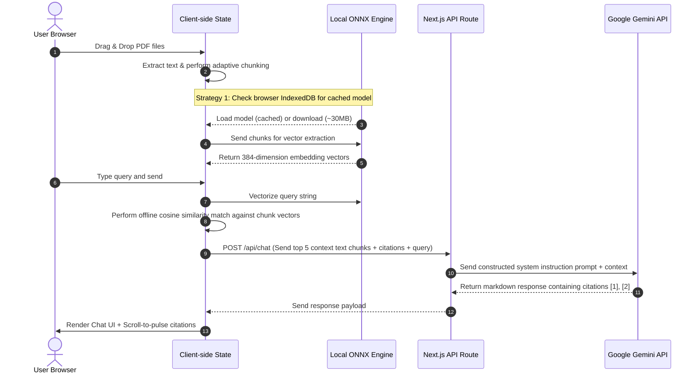
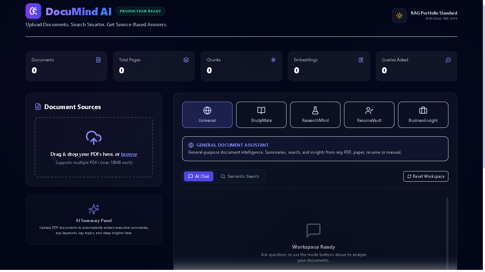
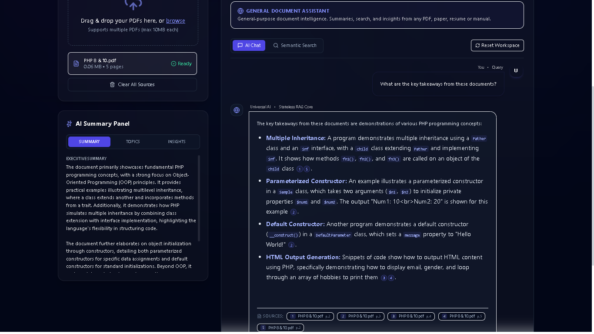
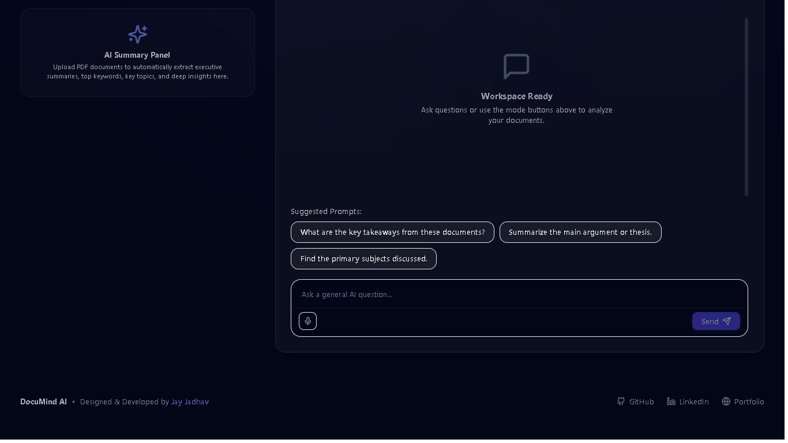

# 🧠 DocuMind AI — Stateless Document Intelligence Platform

> **"Upload Documents. Search Smarter. Get Source-Based Answers — Powered by Client-Side Wasm Retrievals."**
>
> A production-grade, serverless-friendly **Retrieval-Augmented Generation (RAG)** application. By vectorizing files and executing similarity searches entirely inside the browser, it completely eliminates backend database overhead, saves 100% of embedding API costs, and resolves the Gemini API quota rate limits.

---

## 📖 Overview

**DocuMind AI** is an advanced document assistant built on Next.js 15, React 19, Tailwind CSS, and TypeScript. Rather than using typical backend vector stores that lead to API connection leaks, cold starts, and database bills, DocuMind AI implements a hybrid **Stateless Local RAG Architecture**. 

The client extracts text from PDFs locally, splits it into overlapping chunks, generates 384-dimensional embeddings directly in the browser via WebAssembly (ONNX), and runs cosine similarity matching in-memory. The API route only receives the pre-retrieved context chunks to answer questions using **Google Gemini 2.5 Flash**, keeping the serverless backend completely stateless and fast.

---

## ✨ Features

*   **📂 Multi-PDF Parsing & Processing**: Upload several PDF documents simultaneously. Parsing is performed locally via a fast Mozilla `pdf.js` worker.
*   **🧠 Local ONNX Embeddings (Strategy 1)**: Runs the `all-MiniLM-L6-v2` transformer model directly inside the browser using WebAssembly. Model files cache in the user's browser **IndexedDB** on the first run, allowing subsequent uploads to run instantly with zero network load.
*   **📐 Adaptive Page-Aware Chunking (Strategy 3)**: Splitting is performed strictly *within* page boundaries, keeping citations 100% accurate. Chunk sizes scale dynamically depending on document page count (from `800` up to `2500` characters) to keep the browser memory footprint low.
*   **🔎 Offline Semantic Search Engine**: Toggle from chat to a dedicated vector search UI. Query the document and retrieve matched chunks in real-time, displaying cosine similarity percentages, page numbers, and filenames.
*   **💬 5 Tailored AI Mode Personas**:
    *   **Universal AI 🌐**: General document intelligence, summaries, and Q&A.
    *   **StudyMate AI 📚**: Academic revisions, explanations, revision notes, and exam questions.
    *   **ResearchMind AI 🔬**: Extracts methodology, findings, paper limits, and future works.
    *   **ResumeVault AI 📄**: Evaluates candidate resumes, extracts skills, and analyzes role fitness.
    *   **BusinessInsight AI 💼**: Corporate report parser extracting KPIs, risk factors, and summaries.
*   **🏷️ Interactive Click-to-Pulse Citations**: Responses contain tiny circular numbered badges linked to sources. Hovering shows context snippets in tooltips; clicking scrolls the window to the reference details card and highlights it with a pulsing animation.
*   **📊 Live Document Statistics**: Floating dashboard tracks uploaded document count, total page count, chunk counts, generated embeddings, and user queries.
*   **🌌 Ambient Aurora Glow Backdrop**: Slow-drifting blurred gradient background blobs styled behind premium glassmorphic cards.
*   **👥 Developer Footer**: Beautiful profile footer section linking to developer **Jay Jadhav's** GitHub, LinkedIn, and Portfolio.

---

## 🎨 Architecture Diagram

The diagrams below demonstrate the stateless retrieval architecture compared to conventional server RAG:

```mermaid
graph TD
    %% User Action
    User[User Uploads PDF] -->|1. Parse locally| PDFWorker[Mozilla PDF.js Worker]
    PDFWorker -->|2. Array of Page Text| ChunkLogic[Adaptive Page-Aware Chunking]
    
    %% Indexing
    subgraph Browser Client (Local Vector Engine)
        ChunkLogic -->|3. Overlapping Chunks| ONNX[transformers.js Wasm Model]
        ONNX -->|4. Generate 384-Dim Embeddings| IndexedDB[(IndexedDB Cache)]
        ONNX -->|5. Store Chunk Vectors| StateCache[(In-Memory React State)]
    end
    
    %% Query & Retrieval
    UserQuery[User Question] -->|6. Local Query Vectorization| ONNX
    ONNX -->|7. Cosine Similarity Matching| Cosine[In-Memory Similarity Engine]
    StateCache --> Cosine
    Cosine -->|8. Retrieve Top 5 Chunks| Payload[Pre-retrieved Text Context]
    
    %% Completion
    Payload -->|9. Post Context + Query| NextRoute[Next.js API Route /api/chat]
    NextRoute -->|10. System Persona Instruction| Gemini[Google Gemini 2.5 Flash]
    Gemini -->|11. Generate Answer| UserView[Render Cited Answer in Chat]
```

---

## 🔄 Workflow



---

## 📸 Screenshots Section

### 🌌 Desktop Workspace Dashboard
*A premium glassmorphic workspace interface utilizing slow-moving ambient aurora blobs, displaying upload cards, statistics tracker, and AI Mode buttons.*



### 💬 Cited Chat Legibility & Reference Tooltips
*High-contrast bubble text for dark mode readers. Shows compact source pills that pulse-highlight upon citation badge click.*



### 👥 Developer Portfolio Footer Profile
*Modern links containing Lucide icons with smooth transitions pointing to GitHub, LinkedIn, and Portfolio.*



---

## ⚙️ Installation Guide

### Prerequisites
*   **Node.js**: v18.0.0 or higher
*   **Package Manager**: `npm` (included with Node)
*   **Google Gemini API Key**: Grab one from [Google AI Studio](https://aistudio.google.com/)

### Step-by-Step Setup
1.  **Clone the Repository**:
    ```bash
    git clone https://github.com/your-username/documind-ai.git
    cd documind-ai
    ```
2.  **Install Project Dependencies**:
    ```bash
    npm install
    ```
3.  **Environment Variables Configuration**:
    Create a `.env.local` file in the root folder:
    ```env
    # Add your Google Gemini API Key below
    GOOGLE_API_KEY=AIzaSy...your_gemini_api_key_here
    ```
4.  **Run Development Server**:
    ```bash
    npm run dev
    ```
5.  **Open in Browser**:
    Navigate to [http://localhost:3000](http://localhost:3000) inside your web browser.

---

## 🚀 Deployment Guide

DocuMind AI is engineered to run 100% database-free, making it extremely cost-effective and easy to host on **Vercel** serverless pipelines.

### Deploying to Vercel
1.  Install the Vercel CLI or import the repository on the Vercel Dashboard:
    ```bash
    npm install -g vercel
    vercel
    ```
2.  **Add Project Environment Variables**:
    Under your Vercel Project Settings, add:
    *   `GOOGLE_API_KEY`: Your Google Gemini API Key.
3.  **Build & Launch**:
    Vercel will build the Next.js production package. The client-side ONNX indexing architecture ensures your app avoids Vercel's payload restrictions and the 10-second serverless execution limits.

---

## 🛠️ Tech Stack

*   **Framework**: Next.js 15 (App Router)
*   **Runtime Logic**: React 19, TypeScript
*   **Styling**: Tailwind CSS v3, Glassmorphism, CSS Blob Keyframe Animations
*   **Icons**: Lucide React
*   **Local Embedding Engine**: `@xenova/transformers` (Wasm-compiled `all-MiniLM-L6-v2`)
*   **Local PDF Parser**: Mozilla `pdf.js` worker CDN
*   **Large Language Model**: Google Gemini 2.5 Flash SDK
*   **Deployment Target**: Vercel

---

## 📝 Resume Points & Interview Talking Points

Add these high-impact, ATS-optimized bullet points directly to your software engineering resume:

*   **Stateless Browser RAG Architecture**: Engineered a production-ready, database-free RAG application using Next.js 15, React 19, and TypeScript, generating embeddings and similarity indexes entirely on the client side via WebAssembly (ONNX).
*   **API Cost Optimization & Rate-Limit Prevention**: Eliminated 100% of server-side embedding API fees and prevented Gemini 429 quota limits by implementing client-side vector search, caching the model (~30MB) locally in browser IndexedDB.
*   **Adaptive Page-Aware Chunking Engine**: Coded an adaptive chunking utility in TypeScript that automatically scales chunk boundaries (from 800 to 2500 characters) depending on file page counts to optimize client memory limits and ensure 100% citation accuracy.
*   **Real-time Cosine Similarity search**: Authored a custom in-memory vector search library to execute cosine similarity calculations locally, reducing payload sizes sent to serverless Next.js functions from megabytes to kilobytes.
*   **Interactive Source Citation Navigation**: Designed a high-fidelity UI using Tailwind CSS featuring dynamic dark mode contrast syncing, floating ambient blur animations, and custom scroll-to-pulse inline citation navigation.

---

## 📄 Info & Contact

Designed & Developed by **Jay Jadhav**.
*   **GitHub**: [github.com/jayjadhav](https://github.com)
*   **LinkedIn**: [linkedin.com/in/jayjadhav](https://linkedin.com)
*   **Portfolio**: [jayjadhav.dev](https://portfolio.com)
